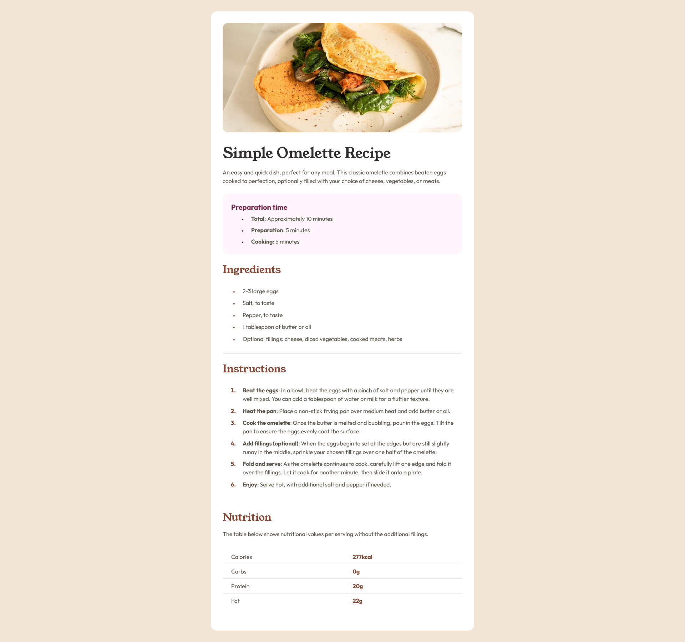

# Frontend Mentor - Recipe page solution

This is a solution to the [Recipe page challenge on Frontend Mentor](https://www.frontendmentor.io/challenges/recipe-page-KiTsR8QQKm). Frontend Mentor challenges help you improve your coding skills by building realistic projects. 

## Table of contents

  - [Screenshot](#screenshot)
  - [Links](#links)
- [Author](#author)

### Screenshot

### Links

- Live Site URL: [https://jo-with-vision.github.io/FEM-recipe-page/](https://jo-with-vision.github.io/FEM-recipe-page/)

## Author

- Frontend Mentor - [@jo-with-vision](https://www.frontendmentor.io/profile/Jo-with-vision)

